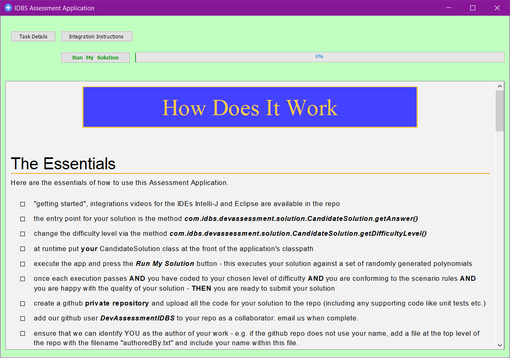

# IDBS Student Developer Assessment Application

Welcome to the IDBS Student Developer Assessment Application github repository.

The purpose for this repo is to provide access for ***invited candidates*** to our coding assessment application. 

If you **have been invited** to complete the code assessment phase of our student software developer application process then please continue. If you have **not** been invited, we are sorry but we cannot accept assessment solutions from anybody other than those that have applied and been invited through our job application process.

# Getting Started

### Step One - Download
Download this repository to your local environment - either clone or download a zip of the repo.

***A note on forking:*** it is best NOT to fork the repository. By forking the repo you will create another ***public repo*** that all other candidates can see and use. This is non-ideal for privacy of your application process.

### Step Two - Develop your Solution
All instructions on how to develop, integrate and ultimately submit your solution can be found by running the assessment application itself. This can be easily achieved by running the "windows cmd" or "bash sh" command line file found in the root directory. Alternatively there are two videos showing how the applicaton can be imported into an IDE (Eclipse & Intelli-J) and excuted - ultimately this is what you need to do so this is a good alternative to getting started (please note the videos were recorded against a slightly older verion of the application and the app does look slightly different now).

If you have any problems getting the application into your IDE and/or getting your solution to work please DO reach out to us at IDBS via the email used in setting up interviews.

Once the application starts, further information on how to develop and integrate your solution can be found via the buttons ***Task Details*** and ***Integration Instructions***  at the top of the application's screen (see below).

The application is a standalone application; it does not interact with the "outside world" (internet, your local machine, etc.) in anyway.

Note: you need to have java 8 or greater installed in your environment to run the assessment application.

### Step Three - Submit
Finally you need to submit your solution to us at IDBS. This is achieved via a github repo, submission instructions are provided within the ***Integration Instructions*** of the application

